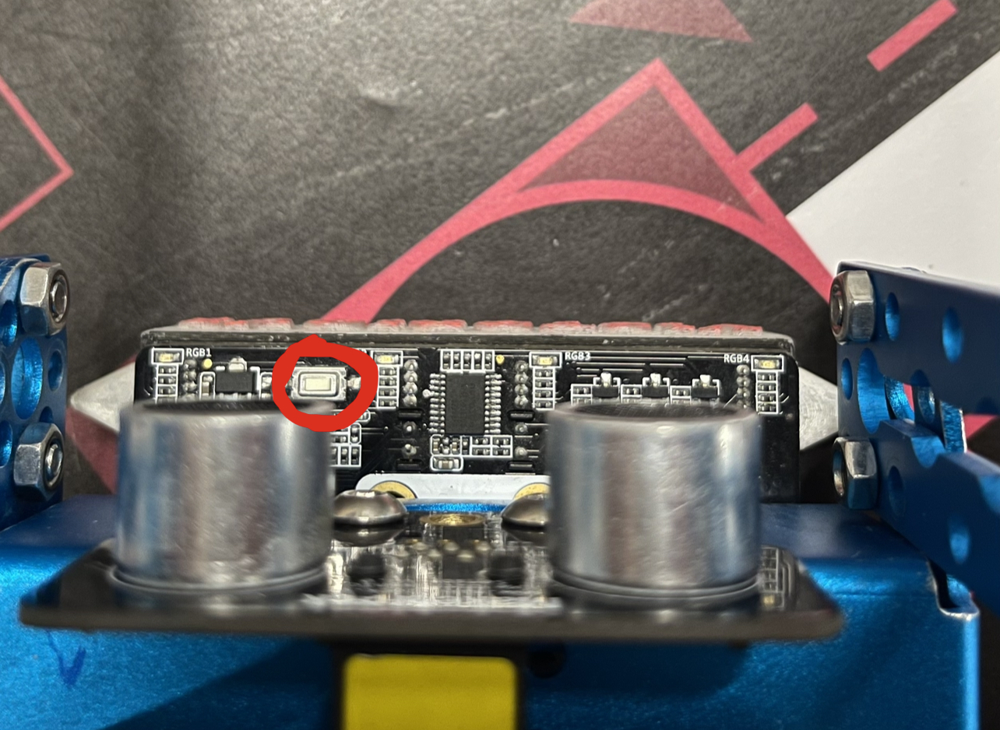
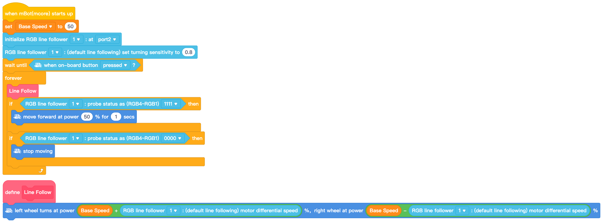

If none of the solutions work, go to simon.

### Common Problems

#### Upload failed

Solutions:
	- Turn on your mBot
	- Try using another cable
	- Update the Firmware

### Line Follower

#### mBot not following the line

Solutions:
	- Calibrate your line follower.  1. Put the line follower on a white surface 
	   2. Click the calibration button two times and wait until the lights stop blinking
	   3. Put the line follower on a black surface
	   4. Click the calibration button wait until the lights stop blinking
	- You can't set your base speed to 100%. Keep it always unter 90%. The base speed variable also defines the max. turn angle while following.
	- Set the line follower sensitivity to `0.8`

### Other cool notes

#### Makeblock challange

##### Optimal line follow speed for challange 2 is 65!

#### Lets simonify (clean) the code!

This is a common peace of code. It's not good. Let's make it good.
 First off, we don't need to declare variables (and constantly update them) if we only use them once.
 
Next, we don't want to type such a long block every time, so we put it in a function.
 Another habit i see too often is putting everything in a forever loop. It may work at first, but it can get really nasty to deal with when having bigger code.
Having everything in a forever loop makes your code event based, which is more appropriate when coding with user interfaces like bluetooth controllers. In this case, we want a more script like code. Every if statement in the forever loop can be replaced with these blocks: 

This is what the simonified code should look like:

